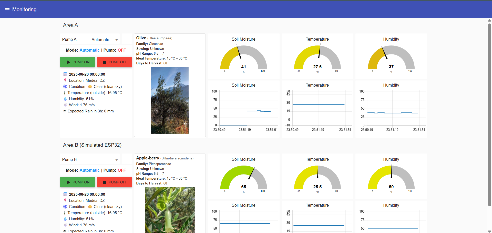
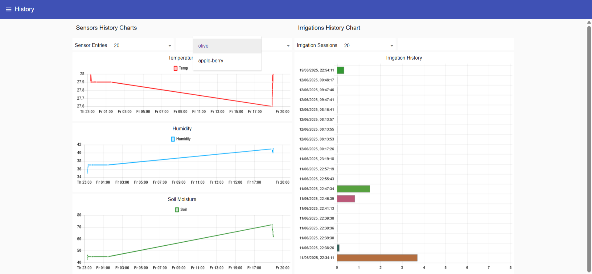
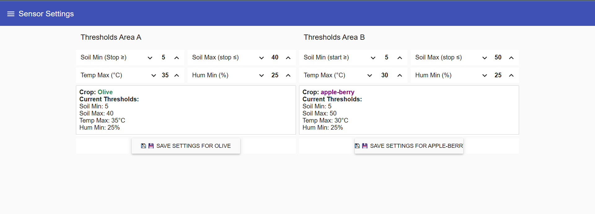
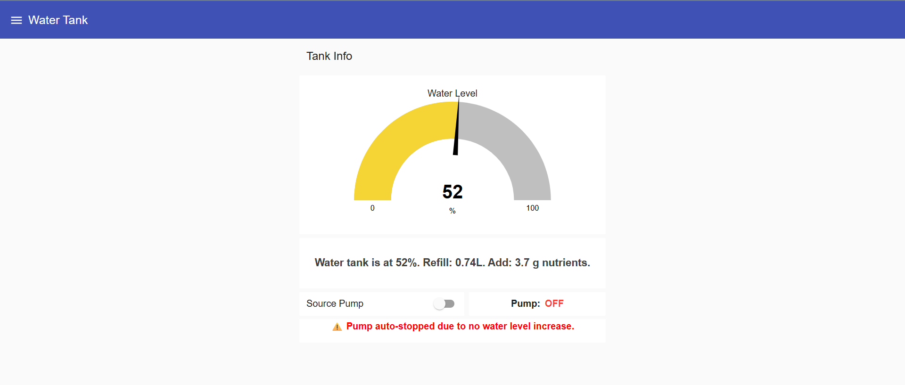
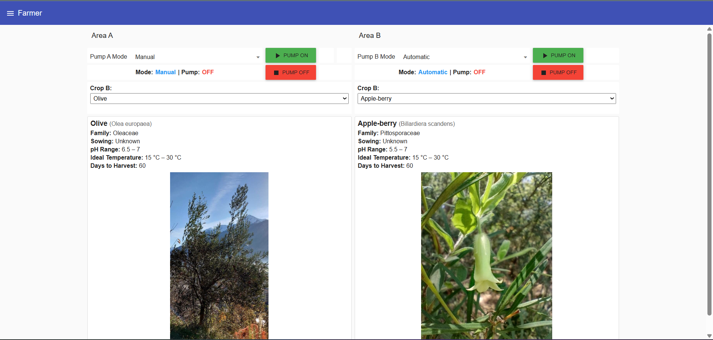

# Smart Irrigation System with Real-Time Monitoring
A full-stack IoT-based smart irrigation system that automates watering decisions using environmental data, real-time monitoring, and external weather/crop-type APIs.
## 📸 Dashboard Overview

## 📊 Data Visualization

## ⚙️ System Control & Configuration

## 🌱 Crop & Recommendation System

