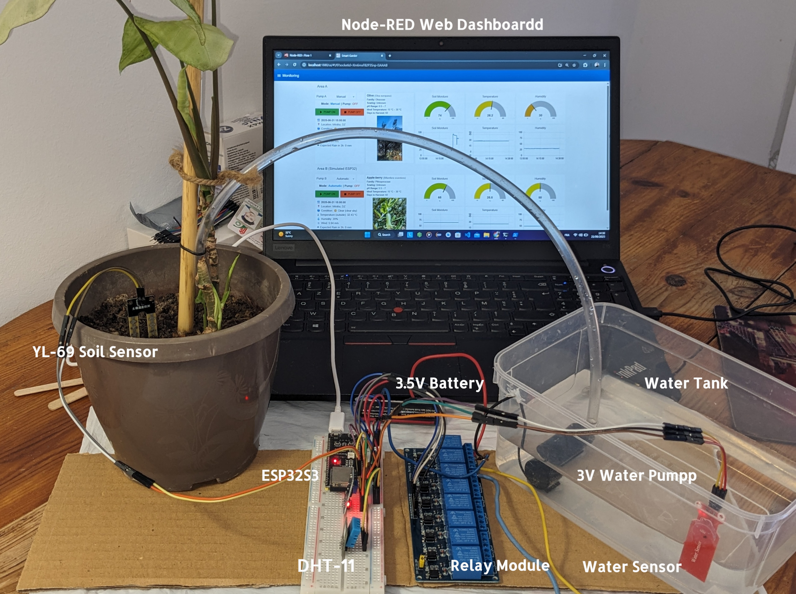
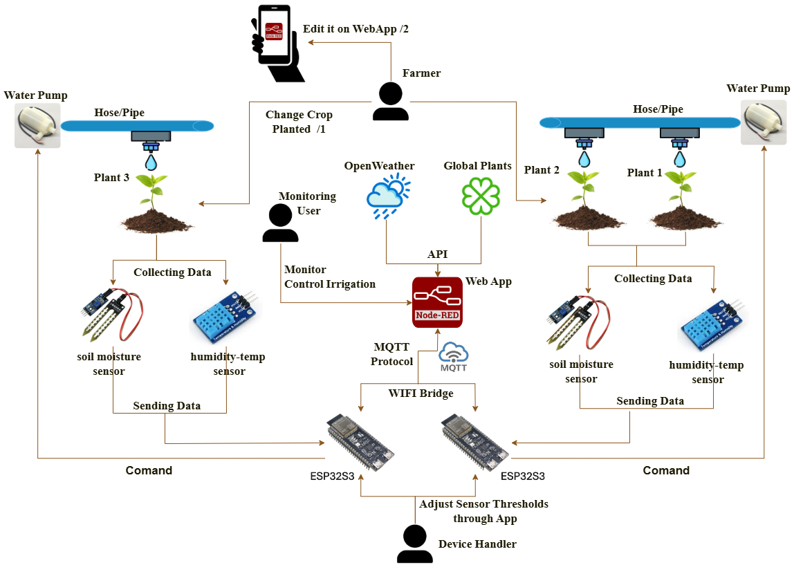
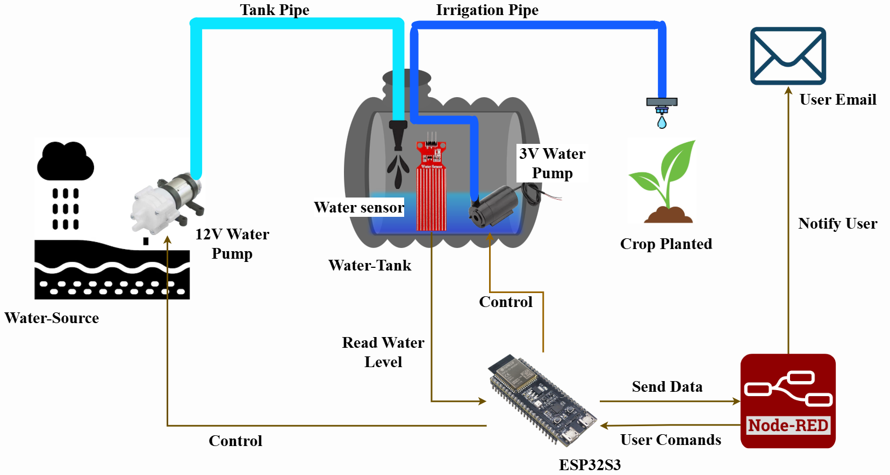

# 🚀 Smart Irrigation System with Real-Time Monitoring

A full-stack IoT-based smart irrigation system that automates watering decisions using real-time environmental data, MQTT communication, and external weather/crop APIs.

---

## 📸 Screenshots

### 🖥️ Monitoring Dashboard

Real-time visualization of environmental conditions and irrigation system status.

---

### 📊 Data Visualization

Historical data tracking with charts for soil moisture, temperature, and humidity.

---

### ⚙️ System Control & Configuration

Dynamic configuration of sensor thresholds and irrigation parameters.

---

### 🌱 Crop & Recommendation System

Integration with external APIs to provide crop-specific recommendations and smarter irrigation decisions.

---

## 🌱 Hardware Setup

### 🔌 ESP32 & Sensor Configuration

ESP32-based system with:
- Soil moisture sensor  
- Temperature & humidity sensor  
- Water pump control module  

---

## 🧠 System Architecture

---

## ⚙️ Features

- Real-time monitoring of:
  - Soil moisture
  - Temperature
  - Humidity  
- Automated irrigation based on:
  - Sensor thresholds  
  - Environmental conditions  
  - Time constraints  
- Manual / Automatic modes  
- Irrigation session tracking (start/stop logging)  
- Historical data visualization  
- Water tank level monitoring  
- External API integration for:
  - Weather data  
  - Crop recommendations  

---

## 🛠️ Technologies Used

- **IoT:** ESP32  
- **Communication:** MQTT  
- **Backend Logic:** Node-RED  
- **Database:** SQLite  
- **APIs:** Weather API, Crop Data API  
- **Dashboard:** Node-RED UI  

---

## 🧩 Key Technical Highlights

- Efficient **data aggregation** using Node-RED `join` nodes  
- Optimized **database writes** with change-detection filtering  
- **State management** using Node-RED flow context  
- **Session-based irrigation tracking** (ON/OFF lifecycle)  
- Real-time system control with manual override  
- Dynamic threshold configuration via UI  

---

## 📂 Project Setup

1. Import `flows.json` into Node-RED  
2. Configure MQTT broker connection  
3. Set up SQLite database  
4. Run Node-RED and open dashboard  

---

## ⚠️ Limitations & Future Improvements

- Refactor into:
  - Node.js backend (better scalability)  
  - React frontend (modern UI)  
- Improve security (parameterized SQL queries)  
- Add authentication system  
- Enable remote deployment (cloud access)  

---

## 💡 Project Goal

This project demonstrates how IoT systems can be integrated with web technologies to create intelligent, automated solutions for real-world agricultural problems.
